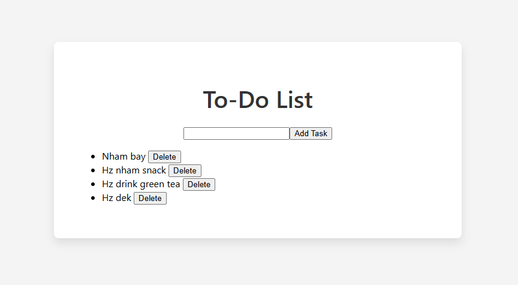
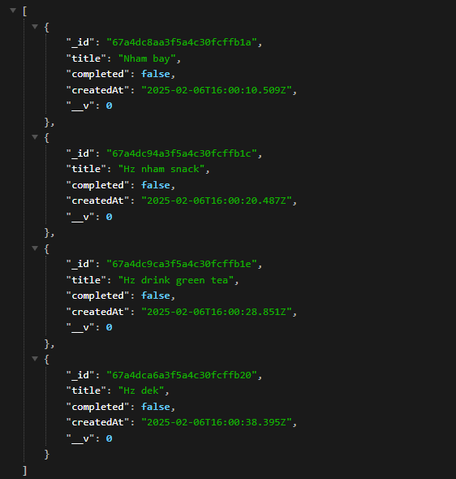
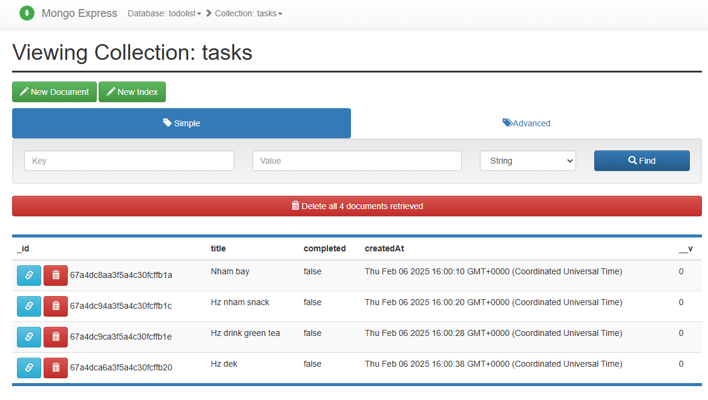

## Usage
Run using docker compose

```bash
docker-compose up --build #run in foreground mode
docker-compose up --build -d #run in detach mode
```

Run using docker multi-stage

```bash
docker compose -f docker-compose-MS.yaml up --build #run in foreground mode
docker compose -f docker-compose-MS.yaml up --build -d #run in detach mode
```
It will build 2 images (frontend, backend), pull 2 images (mongo, mongo-express), and then run 4 containers for each of these images.
- `mongo`: actual database container
- `mongo-express`: web-based mongo db admin interface
- `frontend`: container for hosting frontend (react for normal docker, nginx for multi-stages)
- `backend`: container for hosting backend

## Access
- `frontend web ui`: [https://localhost:3000](https://localhost:3000) 
- `mongo express ui`: [https://localhost:8081](https://localhost:8081)

## WebUI


